# Cheat sheet
__V1.3__

- [Lec](#lec)
	+ [Encoding](#encoding)
		* [Represent radix-N numbers](#represent-radix-n-numbers)
		* [Sign magnitude](#sign-magnitude)
		* [1's complement](1s-complement)
		* [2's complement](#2s-complement)
		* [Fixed Point](#fixed-point)
		* [Floating Point](#floating-point)
	+ [Transistors, Boolean Algebra and Digital Logic](#transistors-boolean-algebra-and-digital-logic)
		* [Transistors](#Transistors)
		* [Boolean Algebra and Digital Logic](#boolean-algebra-and-digital-logic)
	+ [Memory](#memory)
		* [Types of memory/Visualization](#types-of-memoryvisualization)
		* [Store data in Memory](#store-data-in-memory)
	+ [Computer Architecture](#computer-architecture)
		* [CISC vs RISC](#cisc-vs-risc)
		* [AVR Microprocessor](#avr-microprocessor)
	+ [Avr](#avr)
		* [Templates](#templates)
		* [Stack](#stack)
		* [Load/Store](#loadstore)
		* [Branches](#branches)
		* [Logic](#logic)
		* [Others](#others)
- [Lab](#lab)

# Lec
## Encoding
### Represent radix-N numbers
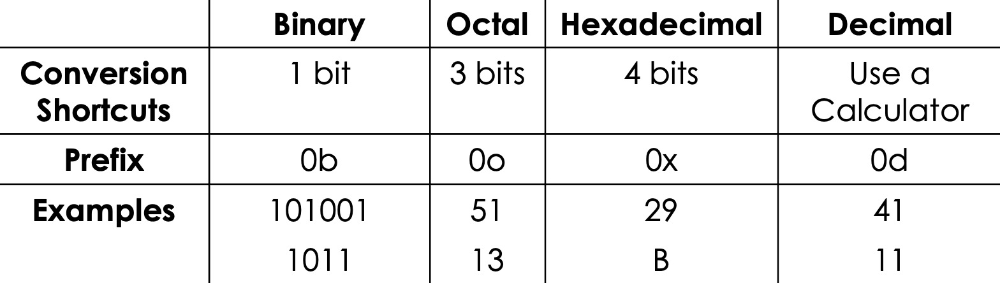  

### Signed Integer

##### Sign magnitude

  

##### 1's complement
```
Inverted binary
Flip all the bits
```

##### 2's complement
```
- The leftmost bit tells us if the number is positive (0) or negative (1).
- To make a negative number, flip all the bits of the positive number and add 1.
- To make a positive number,substract 1 first,flip all the bits of the negative number.
```
##### Fixed Point

```
- integer bits determin range
- Fractional bits determine accuracy
- cannot represent everything clearly,like 1/3
```
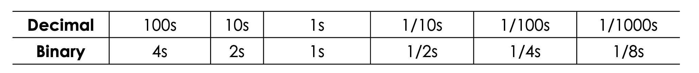  

##### Floating Point
```
- Exponent usually in 2’s compliment
- Choose exponent to cover range
```
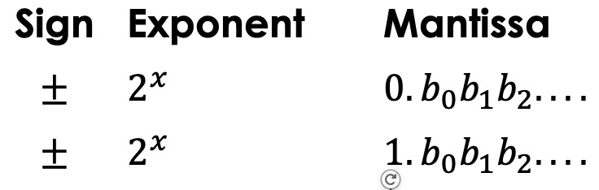  

- max error
```
Max error (floating point) = (1/2) * (Max number - Second max number) 
```
- add
```
To do this we have to shift the numbers so they have the same exponent and then line them up and add them.
```
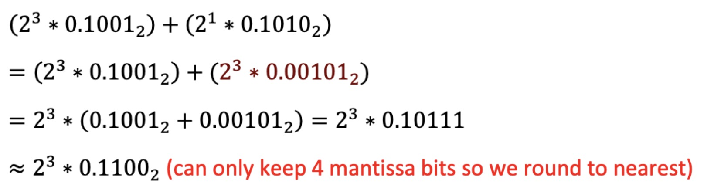  

```
We often have an incorrect answer when adding in floating point because two numbers may be very
different sizes and so, when you change their exponents to be the same size, there are not enough
mantissa bits to adequately represent the number.
```

## Transistors, Boolean Algebra and Digital Logic
### Transistors
```
MOS transistors are switches
```  
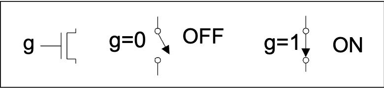  
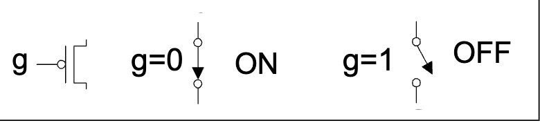  

### Boolean Algebra and Digital Logic

##### Combinational Digital Logic

- **Basic Gates and Truthtables**  
<div style="display: inline-block;">
    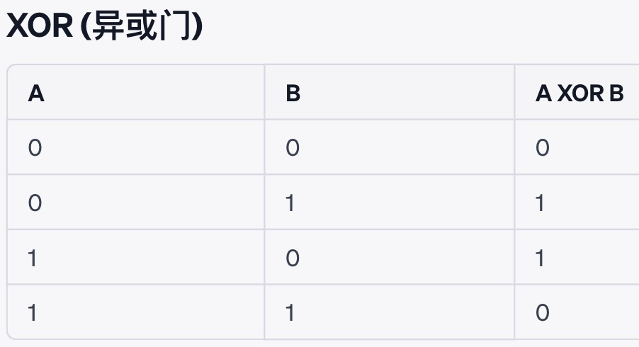
</div>
<div style="display: inline-block;">
    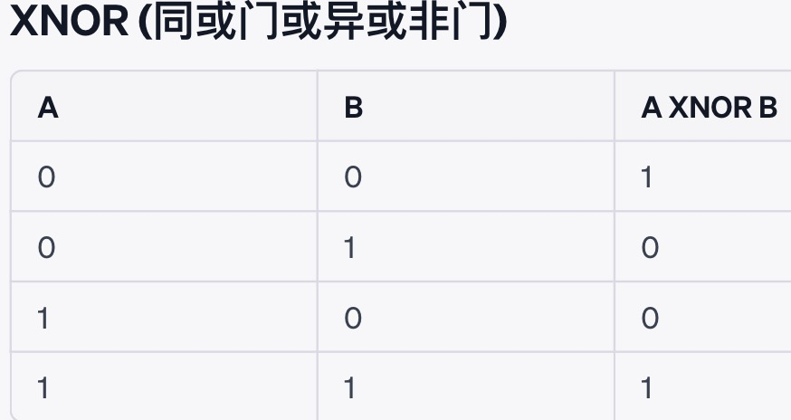
</div>

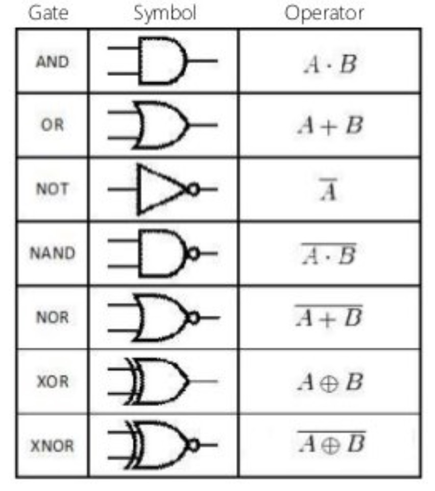  

- **Boolean Algebra**  


- **SOP/POS**
```
SOP(Sum of product) : R = A·B + C·D + E·F  (Find lines which outputs are 1)
POS(Product of Sum) : R = (A + B)·(C + D)·(E + F) (Find lines which outputs are 0)
```

##### Sequential Digital Logic

- **Clock, latches and flip-flops**  
	```
	Clock
	+ Copy input when clock says so
	+ Otherwise don’t change value
	```
	
	```
	Latches
	+ Level-sensitive: Changes or preserves state based on the level (high or low) of a control signal.
	+ Transparent when enabled: When the enable signal is active, the output immediately reflects changes in input.
	```
	
	```
	Flip-Flops
	+ Edge-sensitive: Responds and changes state only at a specific edge (rising or falling) of the clock signal.
	+ State preservation between clock edges: Maintains its state stable in the intervals between clock signal edges.
	```


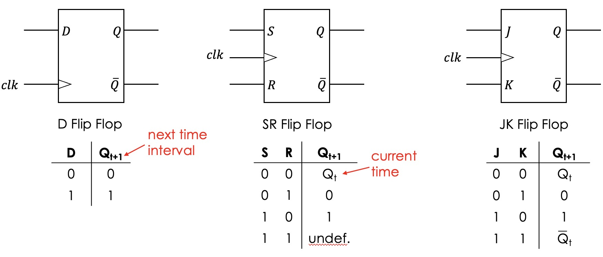

- **Finite State Machine**
```
1. Write the truth table from the inputs and state bits, to future state bits. 
2. Implement each of the outputs with a circuit.
3. Connect the outputs of the function to flip flops.
4. Connect the output of the latch to the inputs of the circuit.
```
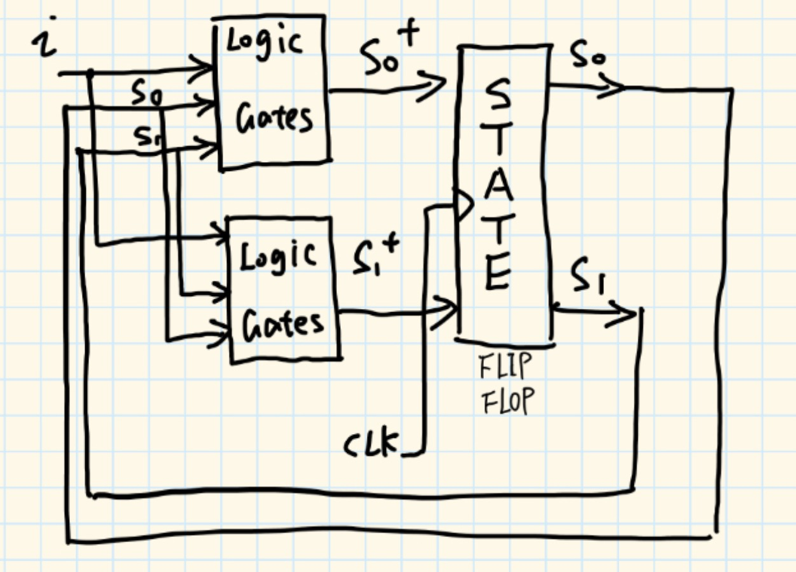

## Memory

### Types of memory/Visualization
##### Register
A register is just a collection of **D-Flip-flops**  
It allows you to represent ‘words’ (your encodings e.g. 4-bit unsigned binary)  

##### RAM(ROM)
```
- KB 2^10 Bytes
- MB 2^20 Bytes
- GB 2^30 Bytes
See graph below
- N: Amount of the element 
	if Bits is given,actual number of address is 2^N
- M: bits of 'word' 
```
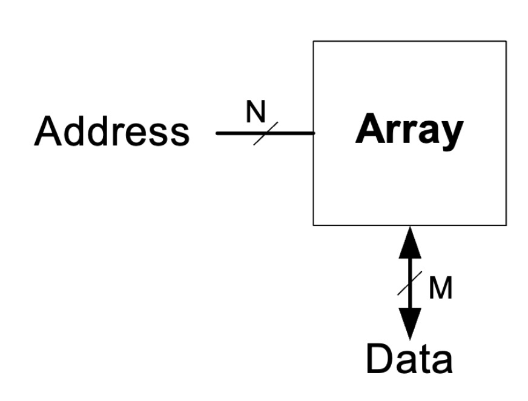
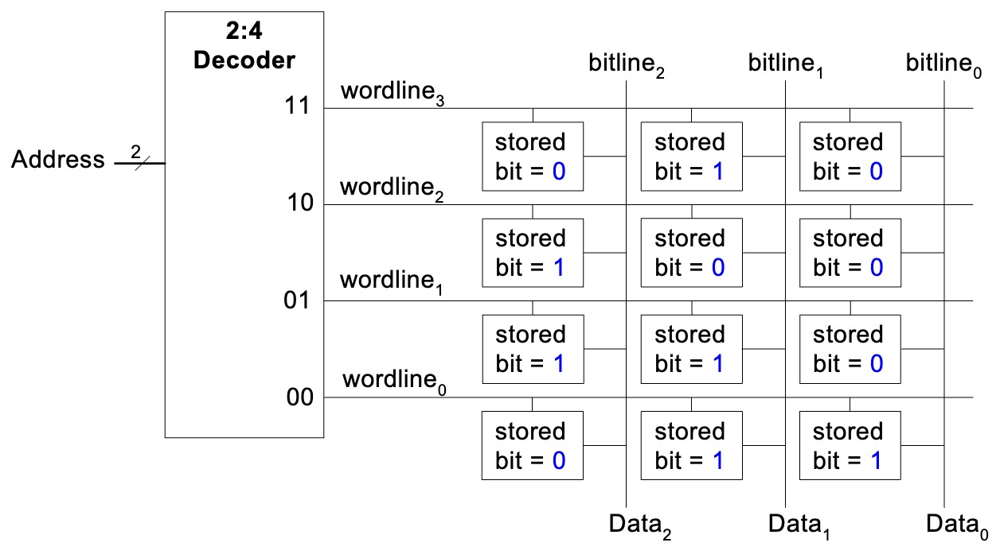

- **Bit cell**

	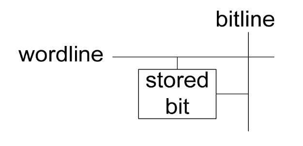  

	DRAM bit cell vs SRAM bit cell  
	`DRAM : samller but slower`  
	`SRAM : bigger but faster`  

	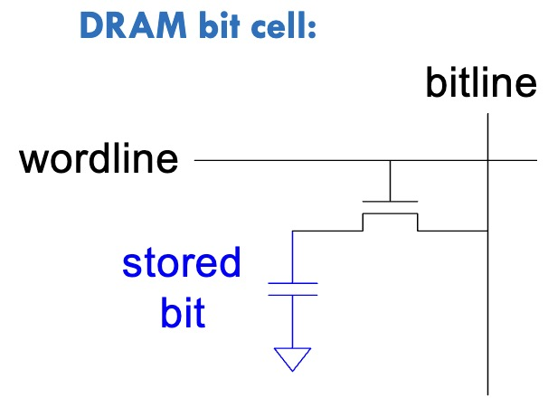
	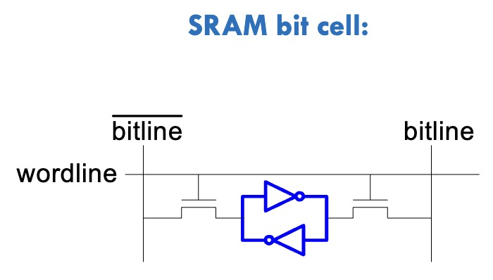  


- **How does ROM work**  
	``Falsh(闪存) is a variant of ROM``  
	  

### Store data in Memory

##### Read/Write
``Follow Little/Big-Endian``

##### Endianness

- **Big-Endian**
	Store 0x1234
	```
	Address N:   0x12
	Address N+1: 0x34
	```
- **Little-Endian**
	Store 0x1234
	```
	Address N:   0x34
	Address N+1: 0x12
	```

##### Store Array in Memory

- **Memory Allocation**
	```
	- Each element in the array uses memory according to its data type.  
		For example, an int might use 4 bytes (depending on the platform) while a char typically uses 1 byte.
	- The total memory used by the array is 
		the size of the data type multiplied by the number of elements.
	```

- **Accessing Elements**  
	``base_address + (element_size * index)``

##### Data Types
**Might be different in different language**  
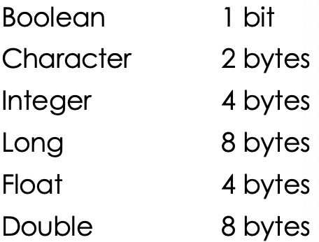  


## Computer Architecture
### CISC vs RISC
```
RISC stands for "Reduced Instruction Set Computer". This architecture is characterized by:

- Instructions have at most two operands.
- There are 32 general-purpose registers that arithmetic operations (ADD, SUB, MUL) can operate over.
- The first register in an instruction is both the destination and one of the sources (e.g., `ADD R15, R16`).
- There is an instruction (`LOAD`) to load a value from a memory location with a symbol name (e.g., `LOAD R2, x` to load variable `x` from memory to `R2`).
- There is an instruction (`STORE`) to store a value from a register to a memory location.

CISC stands for "Complex Instruction Set Computer". This architecture is characterized by:

- Instructions have three operands.
- There are 32 general-purpose registers.
- The first operand is the destination, and the second and third are source operands (e.g., `ADD R2, R15, R16`).
- There is an instruction (`LOAD`) to load a value from a memory location with a symbol name (e.g., `LOAD R2, x` to load variable `x` from memory to `R2`).
- There is an instruction (`STORE`) to store a value from a register to a memory location.
- Arithmetic operations (ADD, SUB, MUL) can have any of its source operands in memory.
```

```
RISC 
	- can do everything that CISC can do.
	- instruction faster(in a bisic way,RISC runs faster, but CISC can use pipelining to be faster)
	- shorter instructions
	- simpler compiler
CISC 
	- takes longer to decode
	- has direct access to operands in memory.(RISC not)
	- almost always has less lines of code. 

Why different instructions? Size/Power/Performance/Mistakes
```


### AVR Microprocessor
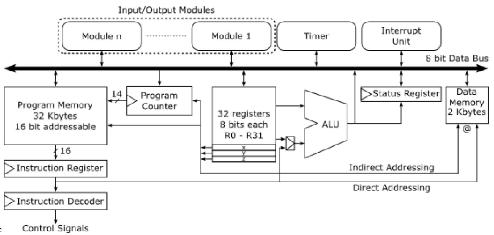  

##### Program memory
```
What does it do?	Store instructions
What operations does it perform?	Read /write
What are it’s properties?	
	- Each cell is ? bit
	- Read/write is always ? bits
	- Different to data memory
```
##### Program counter
```
What does it do?
	- Stores address of next instruction
	- Increments when move to next instruction
What type of digital circuit is it?
	- Register
	- Adder(conditional)
	- Multiplexer
```
##### Register File
```
What is it?
	- Tiny, local memory
		* Temporary storage
What digital circuit is this?
	- 32 8-bit Registers (r0 to r31)
What are X,Y,Z?
	- Design decision
	- Enable 26,27 (x), 28,29 (y), 30,31 (z) to be 16-bit manipulations
```
##### ALU
```
What does it do?
	- Calculations
	- Add/Sub/Conjunction/Negation
How many bits can it add?
	- Tie to the registers
```
##### Data memory
```
What does it do?
	- Stores integers Arrays...
2KB. How many address bits?
	- Needs 11
	- Actually has 12
		* Pretend larger memory
		* Gives 256 additional fake address
		* Allows some faster operations.
```
##### Instruction register
```
What does it do?
	- Remembers current instruction
```
##### Status Register
```
What does it do?
	– Stores flags of special conditions
	- Zero/overflow
What does it listen to?
	- ALU
Where is this information used?
	- Subsequent instruction
```
##### Instruction decoder
```
What does it do?
	- Open instruction, decide what to do
	- Controls rest of circuit
		* Operation: Adding/subtracting
		* Operands
		* Where to write result
```


## Avr
### Templates
##### Basic
```asm
.section .data
;define variables

.section .text
;doing calculations
.global asm_function

asm_function:
;here is your main function
ret

.end
```

##### IF/ELSE
```asm
[Before-if/else code here]
cp r1, r2 ; comparison doesn't have to be R1 and R2 specifically, it can be any 2 registers
br.. else ; If ? than, jump to else case (REPLACE "BR.." WITH WHATEVER BRANCHING INSTRUCTION YOU NEED)
          ; do you need multiple branching instructions?

if:            ; This line is just here for you to remember this is the IF part. You don't have to add it in though.
[IF code here] ; You didn't jump. Therefore, you must be in the 'if then' case, add relevant code for the 'if then' case here.
jmp end_if  ; after completion of the 'if then' go to code after the if statement, skip the 'else' case

else:
[ELSE code here] ; You did jump/branch. Therefore, you must be in the 'else' case, add relevant code for the 'else' case here.

end_if:
[code here] ; Code after the if/else statement should go here.
```

##### While Loop
```asm
loop_comparison: ; you need to check this each time before starting a loop
CP R1, R2 ; comparison doesn't have to be R1 and R2 specifically, it can be any 2 registers
BRLO end_loop; If less than, leave loop (REPLACE BRLO WITH WHATEVER BRANCHING INSTRUCTION YOU NEED)

start_loop_body: ; This line is just here for you to remember the start of the while loop body. You don't have to add it in though.
[loop body code here] ; You didn't branch. Therefore, you must be in the 'loop body' case, add relevant code for the 'loop body' case here.
JMP loop_comparison  ; after completion of the 'if then' go to code after the IF statement, skip the ELSE case

end_loop:
[code here] ; Code after the while loop should go here.
```

##### For loop
```asm
init_loop_iterator:
[initialise_loop_iterator] ; Initialise the loop iterator (which counts how far through the loop you are)

loop_comparison : you need to check if you've finished the loop. P.S. you may need to load the value of your iterator from memory if you used too many registers in the loop body
CP R1, R2 ; comparison doesn't have to be R1 and R2 specifically, it can be any 2 registers
BRLO end_loop; If less than, leave loop (REPLACE BRLO WITH WHATEVER BRANCHING INSTRUCTION YOU NEED)

start_loop_body: ; This line is just here for you to remember the start of the while loop body. You don't have to add it in though.
[loop body code here] ; You didn't branch. Therefore, you must be in the 'loop body' case, add relevant code for the 'loop body' case here.
[modify_loop_iterator] ; Before comparing again, you need to modify the loop iterator
JMP loop_comparison  ; after completion of the 'if then' go to code after the IF statement, skip the ELSE case

end_loop:
[code here] ; Code after the for loop should go here.
```

### Stack
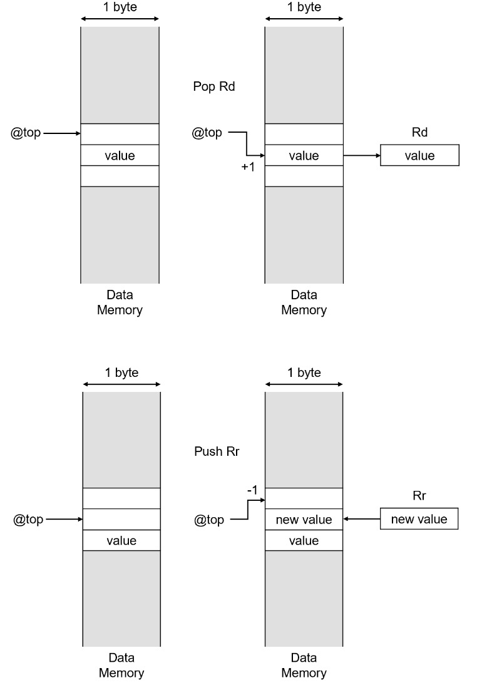

### Load/Store
##### Load
```asm
LDI Rd,K ; Load Immediate(R16-31, 8 bits number) 
```

```asm
LD Rd,X/X+/-X  
; Load Indirect from Data Space to Register using Index X/Y/Z
LDD Rd,Y/Y+3/Y-1 ; Load with Displacement ,only support Y and Z
```

```asm
LDS(32-bit)
LDS Rd,k ; Load Direct from Data Space(consist Register File, I/O memory, and internal SRAM (and external SRAM if applicable))
; 0 <= k <= 65535 (actually is memory address)
; PC = PC + 2
; 32 bits opcode
!!! there is a 16 bits version
```
##### Store
```asm
ST X/-X/X+,Rr ; Store Indirect From Register to Data Space (X/Y/Z)

STD Y/Z + q 	
; Store Indirect From Register to Data Space with Displacement (only Y/Z) 
; q is an integer in [0,63],6 bits

STS k,Rr  ; this is a 32-bit version
; Store Direct to Data Space
; 0 <= k <= 65535 (actually is memory address)
; PC = PC + 2
; 32 bits opcode
!!! there is a 16 bits version
```

### Branches
##### Compare
**for conditional branch**
```asm
CP Rd,Rr
; Rd >= Rr -> Flag C = 0 
; Rd < Rr -> Flag C = 1
; Rd = Rr -> Flag Z = 0
```

```asm
CPI Rd,k
; Rd >= k -> Flag C = 0  
; Rd < k -> Flag C = 1  
; Rd = k -> Flag Z = 0  
```
##### Branches
```asm
JMP k
; 0 <= k < 4M
; PC = k
```

```asm
CALL k 
; Stack = PC + 2
;SP = SP - 2

RET
;SP = SP + 2
;The return address is loaded from the STACK
```
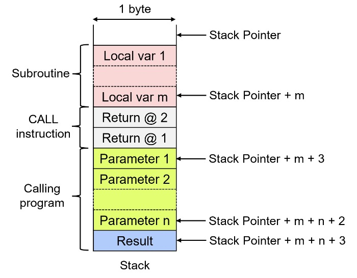  

```asm
BREQ k  
; branch if Flag Z = 1 (Rd = Rr / Rd = k)

BRNE
; branch if Flag Z != 1 (Rd != Rr / Rd != k)
```

```asm
BRSH k
; branch if Flag C = 0  (Rd >= Rr / Rd >= k)

BRLO k
; branch if Flag C = 1 (Rd < Rr / Rd < k)
```


### Logic
```asm
AND Rd, Rr
; Perform bitwise AND between register Rd and Rr, result stored in Rd.

OR Rd, Rr
; Perform bitwise OR between register Rd and Rr, result stored in Rd.

EOR Rd, Rr
; Perform bitwise Exclusive OR between register Rd and Rr, result stored in Rd.

LSL Rd
; Logical Shift Left the contents of register Rd by one bit. Zero is shifted into the least significant bit. The original most significant bit is moved to the Carry flag.

LSR Rd
; Logical Shift Right the contents of register Rd by one bit. Zero is shifted into the most significant bit. The original least significant bit is moved to the Carry flag.

ASR Rd
; Arithmetic Shift Right the contents of register Rd by one bit. The most significant bit (sign bit) is duplicated to keep the number's sign, and the least significant bit is moved to the Carry flag.
```

### Others

```asm
IN Rd, I/O address
; Load an 8-bit value from the specified I/O location into register Rd. The I/O address is a constant within the range of the AVR's I/O space.
;IN R29,0X3E
;IN R28,0X3D
0X3E3D is the address that stores SP

OUT I/O address, Rr
; Store an 8-bit value from register Rr into the specified I/O location. The I/O address is a constant within the range of the AVR's I/O space.

```
# Lab

## Templates

##### 7 segments & interrupt
``按一下加一``

```C++
boolean A, B, C, D, E, F, G;
int count = 0;

void setup() {
  pinMode(2, INPUT);
  pinMode(6, OUTPUT);  // G
  pinMode(7, OUTPUT);  // F
  pinMode(8, OUTPUT);  // C
  pinMode(9, OUTPUT);  // D
  pinMode(10, OUTPUT); // E
  pinMode(11, OUTPUT); // B
  pinMode(12, OUTPUT); // A
  attachInterrupt(0, x, FALLING); //pin2
  
  Serial.begin(9600);
}

void loop() {
  Serial.println(digitalRead(2));
    switch (count) {
      case 0: A=1; B=1; C=1; D=1; E=1; F=1; G=0; break;    
      case 1: A=0; B=1; C=1; D=0; E=0; F=0; G=0; break;
      case 2: A=1; B=1; C=0; D=1; E=1; F=0; G=1; break; 
      case 3: A=1; B=1; C=1; D=1; E=0; F=0; G=1; break;
      case 4: A=0; B=1; C=1; D=0; E=0; F=1; G=1; break;
      case 5: A=1; B=0; C=1; D=1; E=0; F=1; G=1; break;
      case 6: A=1; B=0; C=1; D=1; E=1; F=1; G=1; break;
      case 7: A=1; B=1; C=1; D=0; E=0; F=0; G=0; break;
      case 8: A=1; B=1; C=1; D=1; E=1; F=1; G=1; break;
      case 9: A=1; B=1; C=1; D=1; E=0; F=1; G=1; break;
    }

    digitalWrite(6, G);
    digitalWrite(7, F);
    digitalWrite(8, C);
    digitalWrite(9, D);
    digitalWrite(10, E);
    digitalWrite(11, B);
    digitalWrite(12, A);
  delay(500);
}

void x() 
{
  count = (count + 1) % 10;
}
```

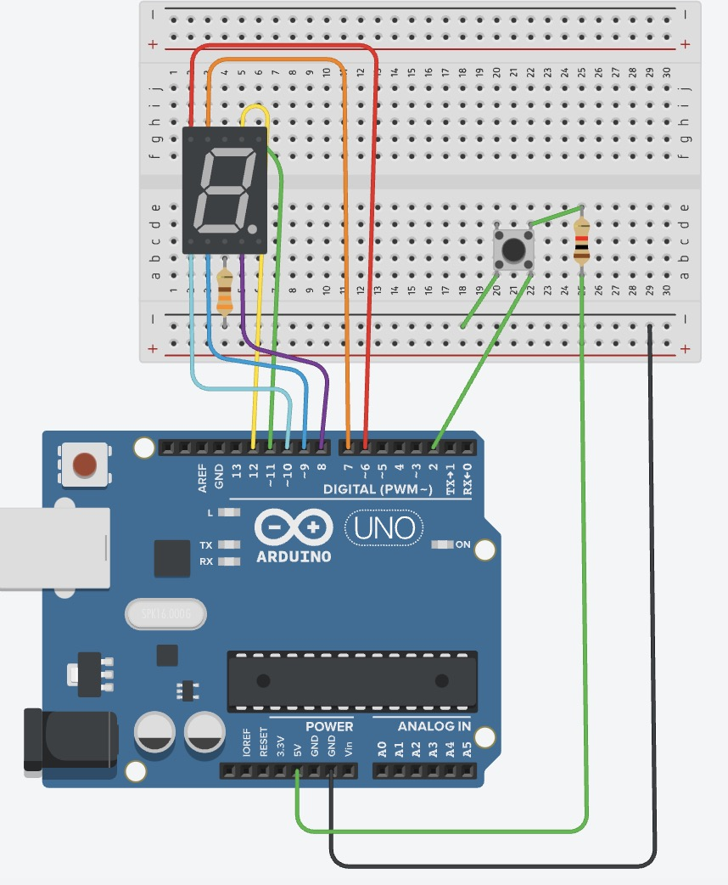  


##### servo motor

```C++
#include <Servo.h>

Servo leftServo;
Servo rightServo;

const int leftPhotoResistor = A0;
const int rightPhotoResistor = A1;
const int threshold = 512;

void setup() {
  leftServo.attach(13);
  rightServo.attach(12);
  
  pinMode(leftPhotoResistor, INPUT);
  pinMode(rightPhotoResistor, INPUT);
  
  Serial.begin(9600);  // Initialize serial communication at 9600 bps
 
}

void loop() {
  int leftValue = analogRead(leftPhotoResistor);
  int rightValue = analogRead(rightPhotoResistor);
  Serial.print(leftValue);
  Serial.print("/");
  Serial.println(rightValue);
  
  delay(10);
}

void forwardMedium() {
  Serial.println("Moving forward at medium speed");
  leftServo.writeMicroseconds(1600);
  rightServo.writeMicroseconds(1400);
  delay(1000);
  stopMotion();
}

void stopMotion() {
  Serial.println("Stopping motion");
  leftServo.writeMicroseconds(1500);
  rightServo.writeMicroseconds(1500);
}

void turnLeftSlow() {
  Serial.println("Turning left at slow speed");
  leftServo.writeMicroseconds(1450);
  rightServo.writeMicroseconds(1450);
  delay(1000);
  stopMotion();
}

void turnRightSlow() {
  Serial.println("Turning right at slow speed");
  leftServo.writeMicroseconds(1550);
  rightServo.writeMicroseconds(1550);
  delay(1000);
  stopMotion();
}

```

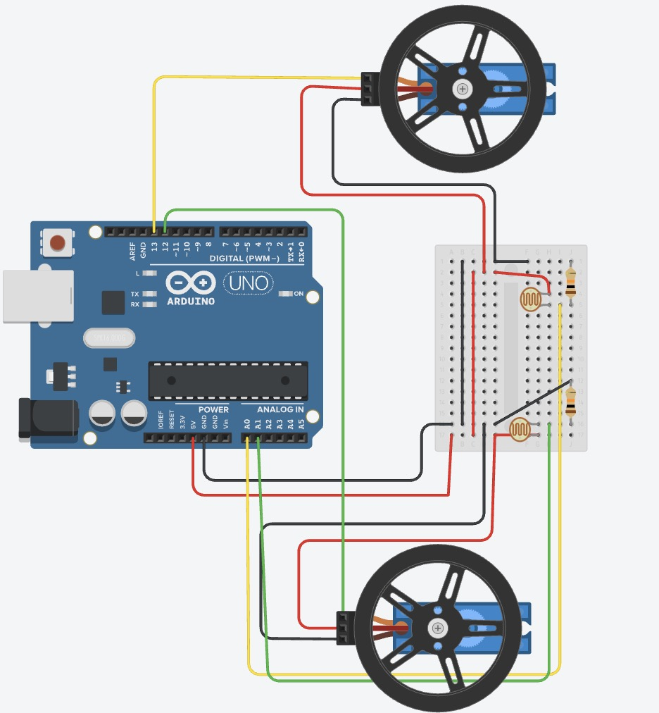  

