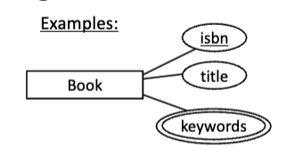

# Week 1
## 1.Data and DBMS

### Terminology
##### DATA
facts that can be recorded
- Important for users
- Need to persist

Importance:
- The day-to-day operations of an organizations depends on accurate data
- The long term planning in an organization depends on accurate data
- Data is a major asset for the organization

##### DATABASE
a collection of data
- Usually quite large
- Usually containing all the data needed to operate an organization

Importance:
- An asset in its own right (Historical data -> enterprise strategy)
- State of database mirrors state of enterprise

##### Database Management System (DBMS)
 software package designed to store and manage one or more databases
 - Allows shared access from many programs
##### How to Store and Use

The usual way to build an information system today, is to write many application programs which all use a shared collection of data, and that data is stored in a DBMS.


### Managing Data
##### Management: the control and organisation of something
- organizational leaders set high-level goals ('policy')
- technical people: settings, processes('mechanism')

##### Data Management concerns
- Deciding <mark style="background: #FF5582A6;">what</mark> data to hold (and when to remove it)
- Ensuring accuracy of the data
- Ensuring proper use of the data, only by appropriate people
- Ensuring efficient use of the data

##### Data Management Decisions
- The <mark style="background: #FF5582A6;">performance</mark> that users get, and the <mark style="background: #FF5582A6;">security </mark> of the whole system, can be greatly affected by the way the data is stored, and the settings of system configurations
- What helps one user may be bad for others – But some changes have wide benefits
- The needs of the whole organization can be considered by people who are responsible to the whole, rather than to individuals or subsets

##### The Structure of Data

“<mark style="background: #FFB8EBA6;">System Catalogue</mark>” or “<mark style="background: #FFB8EBA6;">Data Dictionary</mark>”: A key idea in DBMSs is for the database itself to store descriptions of the format of the data.Also called <mark style="background: #FFB8EBA6;">meta-data</mark>

## 2.The relational data model
### Terminology
##### Relational DBMSs
All data is seen by users as tables of related, uniformly structured information
- No duplicate rows, order is not important 
- Each entry is simple: integer, string, etc
- <mark style="background: #FF5582A6;">Matching values in different tables indicate connections</mark>
##### Instance
An instance is the contents of the database at a <mark style="background: #FF5582A6;">single</mark> time
##### Schema
- The schema describes the <mark style="background: #FF5582A6;">structure</mark> of data in a particular <mark style="background: #FF5582A6;">database</mark>
- The instance at any time must fit the pattern of the schema
##### <mark style="background: #FF5582A6;">Data Design</mark>
- A key task when creating an information system is to <mark style="background: #FF5582A6;">decide on the schema</mark> that will be used for the data
- The process of <mark style="background: #FF5582A6;">making this decision</mark> is called “data design”
	- first produce a<mark style="background: #FF5582A6;"> conceptual or semantic model</mark>
	- then translate this into a <mark style="background: #FF5582A6;">relational schema</mark>
	- then evaluate the schema for quality, and <mark style="background: #FF5582A6;">improve</mark> it if needed
##### Languages
- **DDL**: Data Definition Language is used to <mark style="background: #FF5582A6;">define the schema</mark>. It allows one to tell the DBMS what tables exist, and what structure they have
- **DML**: Data Manipulation Language is used to <mark style="background: #FF5582A6;">access the data</mark>.
- For a relational DBMS,<mark style="background: #FF5582A6;"> both DML and DDL are in SQL</mark>

##### Levels of Abstraction


##### Data Independence
- <mark style="background: #FF5582A6;">(App | stuctured,stored)</mark>: Applications are insulated from how data is structured and stored.
- <mark style="background: #FF5582A6;">Logical data independence</mark>: Protection from changes in logical schema (eg from introducing an extra column in a table).当数据库的逻辑模式发生变化时（例如，添加新列、修改表结构等），应用程序不需要相应地改变.
- <mark style="background: #FF5582A6;">Physical data independence</mark>: Protection from changes in physical structure and location of data. 当数据库的物理存储方式或数据的物理位置发生变化时，应用程序不需要相应地改变.
- Data independence is one of the most important <mark style="background: #FF5582A6;">benefits</mark> of using a DBMS
## 3.Careers and people ’s roles

##### End Users
End users are people who do something that advances the organization’s purpose
##### Application Programmers
IT Professionals who <mark style="background: #FF5582A6;">produce the applications that end users can run</mark>

##### DBA
The <mark style="background: #FF5582A6;">Database Administrator</mark> is responsible to organization’s management for <mark style="background: #FF5582A6;">effective and efficient use</mark> of resources in <mark style="background: #FF5582A6;">providing access to data</mark>.

##### DBMS Vendor Staff
 Each vendor (Oracle, IBM, Microsoft etc) employ staff to help sell more installations, in particular by helping organizations that have bought the software 
 - DBMS Implementors
 - Tools Development 
 - Training Staff
 - Sales support staff 
 - Operational support staff

## 4.Others
### File Systems VS DMBS
##### File Systems Disadvantages
1. 数据冗余和不一致 (Data redundancy and inconsistency)
2. 访问数据困难 (Difficulty in accessing data)
3. 缺乏中央控制 (No central authority)
4. 完整性问题 (Integrity problems)
5. 原子性问题 (Atomicity issues)
6. 并发访问问题 (Concurrent access issues)
7. 安全问题 (Security problems)
##### DBMS Advantages
- Data independence and efficient access
- 解决数据冗余和不一致问题 (Solves data redundancy and inconsistency)
- 简化数据访问 (Simplifies data access)
- 维护数据完整性和安全性 (Maintains data integrity and security)
- 高效处理并发访问 (Efficient concurrent access),recovery from crashes
- Hopes for extracting value by connecting data from different sources
- Uniform data administration
- Reduced application development time
##### Considerations
- 可能有性能和成本的代价 (Potential cost and performance trade-offs)
- 可能不适用于特殊数据类型 (May not perform well with specialized data types)


# Week 2

## 1.Relational Model, Graphical notation
### 1.1 Text Format for Relational Schema

```SQL
Supplier(SuppID: int, SName:string, Phone: string); Product(ProdID:int, Descr:string, SuppID:int)
```

Alternatively: sometimes leave out the datatype information (implicit)

```SQL
Supplier(SuppID, SName, Phone); Product(ProdID, Descr, SuppID)
```

### 1.2 Primary key

Often, a table has a column which serves as an identifier for the rows
- In any instance, the values of this column must be <mark style="background: #FF5582A6;">unique</mark> among the rows
- Show this in schema by <mark style="background: #FF5582A6;">underlining</mark> the column name.

Other tables can include this identifier as a column to make connections to the given table.

### 1.3 Relational Schema Diagrams
Show an arrow from the referring column/table, to the one where the values are found as identifier
这个箭头表示“Supplier”表和“Product”表之间的关系。在数据库设计中，这通常代表外键约束。具体来说，箭头指向“Product”表中的“SuppID”字段，表示该字段是“Supplier”表中“SuppID”字段的外键。这意味着“Product”表中的每条记录都与“Supplier”表中的一条记录相关联，确保数据的完整性和一致性。


### 1.4 Composite primary key
For each possible instance, it is not allowed for two rows to match values in every one of the columns involved.
Show this in schema or schema diagram, by underlining all the column names involve.

### 1.5 Others
<mark style="background: #FF5582A6;">Data Model</mark> can be 
- A model of the structure of a particular database (ie the schema for that database)
- OR, the kind of modeling approach that is used for the schema (eg “relational model”, “document model”, etc)

## 2.Choices for capturing the same information
**The same information about the world, can be captured in relational databases with different structure (schema)**

## 3. Database design Sequence
### 3.1 Requirements Analysis
Understand
- what data is to be stored
- what applications must be build
- what operations are most frequent

### 3.2 Conceptual Design
Develop
- High-level description of the data closely matching how users think of the data
- for communication with stakeholders 利益相关者

### 3.3 Logical Design
Convert
- conceptual design into a relational database schema(logical)

### 3.4 Physical Design
Convert
- logical schema into a physical schema(storage choices) for a specific DBMS and tuned for workload
将逻辑模式转化为物理模式（存储选择）是指将数据库的抽象设计（逻辑模式）转换为实际存储实现（物理模式）的过程。这包括选择合适的存储结构、索引类型和数据库系统的配置，以便在特定的数据库管理系统（DBMS）上有效地存储和管理数据。
Storage Structure，Index Design, Partitioning Strategy...

## 4.Conceptual Data Model, ERM
### 4.1 Conceptual Data Model
##### Goal
Specification of database information content

##### Methodology 方法论
- Conceptual Design:  A technique for understanding and capturing business information requirements
	- depicts the associations among different categories of data within a business or information system
	- Usually shown with a diagram notation
- Later one can convert conceptual database design to logical schema and express that in SQL DDL

##### Features
- Conceptual Database Design does not tell how data is implemented, created, modified, used, or deleted.
- Works as communication vehicle
- Facilitate planning, operation & maintenance of various data resources

#####  Independency
A conceptual data model is independent of kind-of-data-model, and of DBMS technology

### 4.2 Entity Relationship Model
###### Definitions
- A data modeling approach that depicts the associations among different categories of data within a business or information system
- A database 'schema' in the ER Model is represented pictorially (ER diagrams).
- It is about what data needs to be stored

### 4.3 Entities
##### Entity
a person, place, object, event, or concept about which you want to gather and store data

##### Entity Type (also called entity set)
a collection of entities that share <mark style="background: #FF5582A6;">common properties or characteristics</mark>

- **Domain** : possible values of an attribute
- Simple attributes eg Name
- Composite attributes , eg address (House number + Street Name + Suburb)
- Single-valued attributes 单值属性是指一个实体只能有一个值的属性,eg date of birth
- Multi-valued attributes, eg Hobbies
##### Attribute
describes one aspect of an entity type。

##### Primary Key for Entity Type
- A Primary Key (often abbreviated PK) for an entity type is an attribute (or combination of several attributes) that is used to <mark style="background: #FF5582A6;">uniquely identity</mark> an entity.
	- That is, every entity in the set has a different value for that attribute [or combination of attributes]
	- depicted by underlining that attribute [or all the attributes that combine as the identifier
- There may be a choice possible in design, with more than one attribute [or combination] that could serve to distinguish the entities. Any attribute [or minimal combination of attributes] that distinguishes all the entities from one another, is called a <mark style="background: #FF5582A6;">Key</mark>.
- <mark style="background: #FF5582A6;">Entity Schema</mark>: entity type name, attributes (+domains), PK
##### Entity Types and Attributes in E-R Diagram
- Entity Type represented by a rectangle
- Attribute depicted by ellipse
	- Double ellipse for <mark style="background: #FF5582A6;">multi-valued</mark> attribute
	- Primary Key column(s) are underlined
	- High-level description may leave out attributes, or show them elsewhere


- <mark style="background: #FF5582A6;">Composite attribute</mark> - name


### 4.4 Relationships
##### Relationship
relates or connects two or more entities (often from different entity types)
##### Relationship Type (also: Relationship Set)
is a set of similar relationships (the entities in each relationship are always from the same entity types)
在一个“朋友”关系中，实体类型是“人”，关系中的所有实体都来自“人”这个实体类型。也就是说，朋友关系中的所有成员都是人，不会包括其他类型的实体。

##### Relationship in ER Diagram
- Diamond represents a relationship type
- Lines connect the involved entity types to the relationship type.


##### Warnings
A <mark style="background: #FF5582A6;">relationship</mark> in an ER conceptual model must not be confused with <mark style="background: #FF5582A6;">relation</mark> in relational model (which means set of tuples) 
- The information about a relationship may be captured in a relation in a relational schema which we eventually produce for the database 
- The information about an entity type may also be captured in a relation in a relational schema which we eventually produce for the database
ER模型中的“关系”描述的是实体之间的关联，而关系模型中的“关系”表示的是数据库中的一个表格。最终，这些信息都会转换为关系数据库模式中的表格来存储和管理。

##### Relationship Attributes & Roles
Relationship-Attribute
- Relationships can also have additional properties 
- E.g., John enrols in ISYS2120 as an elective – John and ISYS2120 are related .Elective is the value of the degree_role attribute for this relationship


Relationship-Role
Relationship-Role Each participating entity can be named with an explicit role.
Example: Supervises is a relationship type between two Employees, one has role Manager, the other has role Subordinate

### 4.5 Graphical Representation of Relationships in E-R Diagrams
-  Diamond represents relationship type
- Ellipse represents attribute of the relationship type, linked by line to the diamond


##### Relationship Degree

##### Multiplicity of a Relationship
- "Many-to-1 from A to B" means each A is related to at most 1 of B
- "Many B to (at most) one A" can also be called “One A to many B”, or “One-to-many from A to B”
- Natural language can be confusing: 
	- even when we know “one A can be related to many B”, that doesn’t tell that the relationship is “One to many”. That requires thinking about “<mark style="background: #FF5582A6;">can a B have at most one A, or not?</mark>”


**Some examples:**
<mark style="background: #FF5582A6;">Many-to-many</mark>
- It is possible for a subject to have 0 students enrolled (eg COMP2017), 1 student (SOFT2412), or more than 1 student (ISYS2120)
- It is possible for a student to be enrolledin 0 subjects (Alan), 1 subject (Meg), or more than 1 subject (Sue)

This is a many-to-many relationship with <mark style="background: #FF5582A6;">total participation by Subject and total participation by Degree</mark> :


<mark style="background: #FF5582A6;">Many-to-one</mark> 
There isn’t an employee who works in 0 faculties, or who works in more than 1 faculty.

In this case, we say that this relationship is a many-to-one relationship with <mark style="background: #FF5582A6;">total participation</mark> by employee (surjective in math, i guess..., codomain = range)


This is a many-to-one relationship without total participation.


##### Key Constraint on diagram
If, for a particular participant entity type, each entity participates in <mark style="background: #FF5582A6;">at most one relationship</mark> instance, we say that the corresponding role is a key of relationship type.
- E.g., a Subject instance is in at most one WhereExamHeld relationship instance (there is at most one room where the subject has in exam)
- there may be many subjects who have exam in a particular room
- also called: many-to-one or N:1 relationship from Subject to Room
<mark style="background: #FF5582A6;">Subject is the key!</mark>

Contrast with “many-to-many” or “one-to-many” when there is not such a constraint on this side (one entity instance can participate in many relationship instances); then we have a plain line (no arrowhead)


##### Participation Constraint on diagram
If, for a particular participant entity type, each entity participates in at least one relationship instance, we say that the corresponding role has <mark style="background: #FF5582A6;">total participation</mark> in the relationship: 
- Eg a Subject instance is in at least one CountTo relationship instance (the subject must count to a degree); Subject has total participation in CountsTo

Representation in E-R diagram [notation for ISYS2120]: a total relationship is shown by a <mark style="background: #FF5582A6;">thick line</mark> from the entity type that must participate to the relationship diamond.

Contrast with “partial participation” when an entity can participate in a relationship, but it might not; then we have a <mark style="background: #FF5582A6;">thin</mark> line.


##### Participation and Key Constraint
If every entity participates in exactly one relationship, both a participation and a key constraint hold.
Representation in E-R diagrams: <mark style="background: #FF5582A6;">thick arrow</mark>


##### Cardinality Constraints
We can generalization key and participation constraints but being more precise about the <mark style="background: #FF5582A6;">numbe</mark><mark style="background: #FF5582A6;">r</mark> of relationship instances an entity instance is allowed to participate in.

A cardinality constraint for the participation of an entity set E in a relationship R specifies how often an entity of set E participates in R, giving a <mark style="background: #FF5582A6;">lower limit </mark>(“at least”, minimum cardinality) and <mark style="background: #FF5582A6;">upper limit</mark> (“at most”, maximum cardinality
- **1..*（一对多）**：每个实体至少参与一次该关系，但可以参与任意多次。
- **0..1（零或一）**：每个实体可以选择不参与该关系，或者参与一次。
- **1..1（一对一）**：每个实体必须且只能参与一次该关系。


##### Comparison of Notations


##### Weak Entities , Rrepresentation
Weak entity type: An entity type that does not have a primary key among its attributes. 
- That is, instances need more than the attributes of the entity to distinguish them

Instead, the entity instances are distinguished in part by knowing which entity of another type, that they are in a total M:1 relationship with

Call this the <mark style="background: #FF5582A6;">identifying relationship </mark>(and the other type is called the <mark style="background: #FF5582A6;">identifying entity type</mark>).Also called “owning relationship and owning type"


##### Enhanced E-R Model(啥也不是,屁话还多)
ER model in its original form did not support 
- SPECIALIZATION/ GENERALIZATION 
- ABSTRACTIONS (‘aggregation’) 
- These concepts are widespread now in object-oriented languages

This let to development of ‘Enhanced’ ER mode
- Includes all modeling concepts of basic ER 
- Additional some object-oriented-like concepts: subclasses/superclasses, specialization/generalization, categories, attribute inheritance 
- The resulting model is sometimes called the enhanced-ER or Extended ER (E2R or EER) model 
- used to model applications more completely and accurately if needed

##### Generalization / Specialization
Arranging of entity types in a type hierarchy
- Determine entity types whose instance entities are (always) also instances of another entity type, and therefore <mark style="background: #FF5582A6;">have all the attributes </mark>of the more general type (perhaps with others)

Definition Generalization / Specialization / Inheritance
Two entity types E and F are in an <mark style="background: #FF5582A6;">ISA-relationship</mark> (”F is a E”),即F是E的一种, if:
- the set of attributes of F is a <mark style="background: #FF5582A6;">superset</mark> of the set of attributes of E
-  the entity set F is a subset of the entity set of E (“each f is an e”)

One says that F is a specialization of E (F is subclass) and E is a generalization of F (E is superclass)

Depicted by a triangle labeled IsA, with lines to superclass and subclass
- By convention, aim that superclass is higher in diagram than triangle, and subclass is lower in diagram
懒得放图了,就是一个里面是写ISA的三角形,上方指向superclass


##### Attribute and relationship inheritance

A subclass entity type inherits all the attributes of its superclass.

A subclass entity type inherits all the <mark style="background: #FF5582A6;">relationship</mark> participations of its superclass.
- We only show on a rectangle, the attributes and relationships which it <mark style="background: #FF5582A6;">has not inherited</mark> (those that are not found in superclass)! The inherited ones are shown on the superclass


##### Constraints on ISA Hierarchies
We can specify overlap and covering constraints for ISA hierarchies:

Overlap Constraints
- Disjoint
	- A higher-level entity instance can belong to at most one lower-level entity set, 一个人只能是“学生”或“员工”中的一个
	- Noted in E-R diagram by writing disjoint next to the ISA triangle
- Overlapping (state this explicitly on the diagram)
	-  A higher-level entity instance can belong to more than one lower-level entity set

Covering Constraints
- Total
	- A higher-level entity instance must belong to at least one of the lower-level entity set
	- Denoted with a <mark style="background: #FF5582A6;">thick line</mark> between the ISA-triangle and the superclass
	- 所有高层实体都必须在低层实体中找到对应的分类
-  Partial (the default)
	- A higher-level entity instance need not belong to one of the lower-level entity sets
	- 一个高层实体实例不必属于任何一个低层实体集合

##### Aggregation 挺废话的,看图就行
Relationship sets works-on and manages represent overlapping information
- Every manages relationship corresponds to a works-on relationship
- <mark style="background: #FF5582A6;">However, some works-on relationships may not correspond to any manages relationships</mark> . So we can’t discard the works-on relationship

Eliminate this redundancy via aggregation
- Aggregation allows an relationship set to be treated as an (abstract) entity set for the purpose of participating in another relationships
- Allows relationships between relationships 
- Abstraction of relationship into new entity


